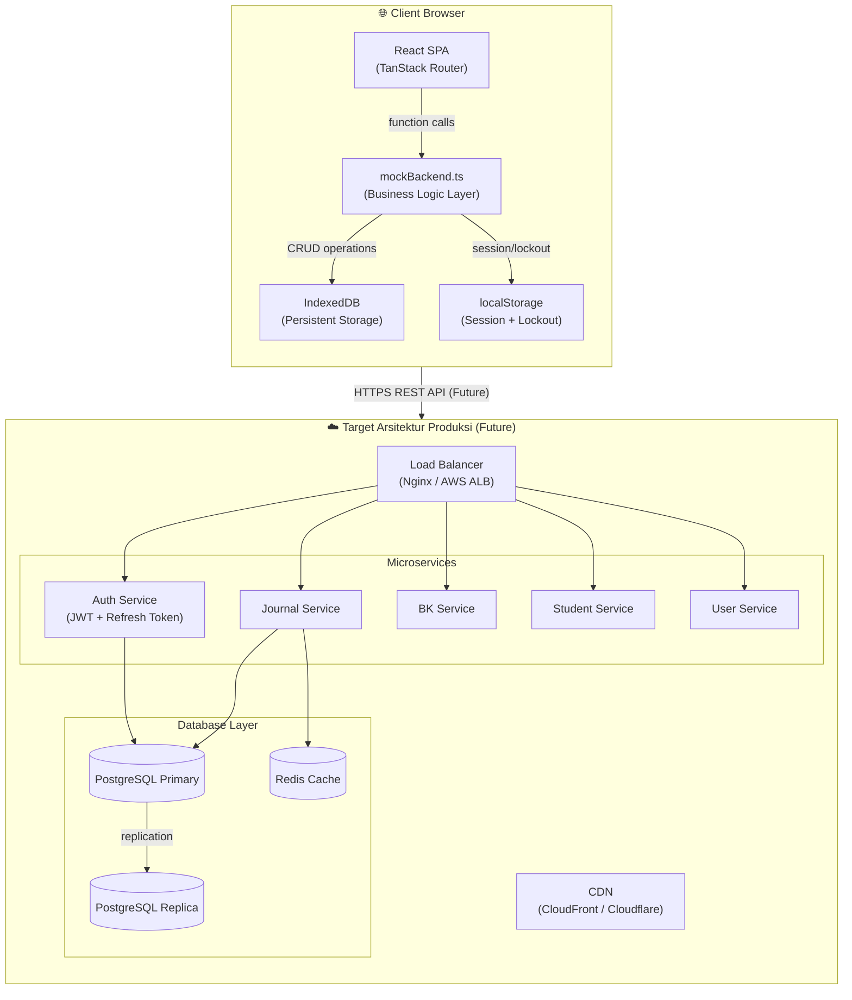
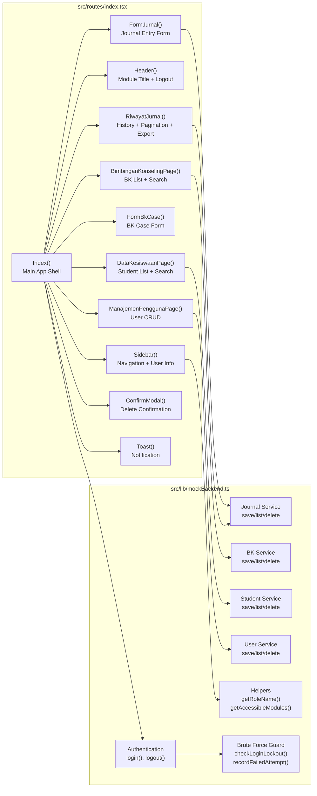
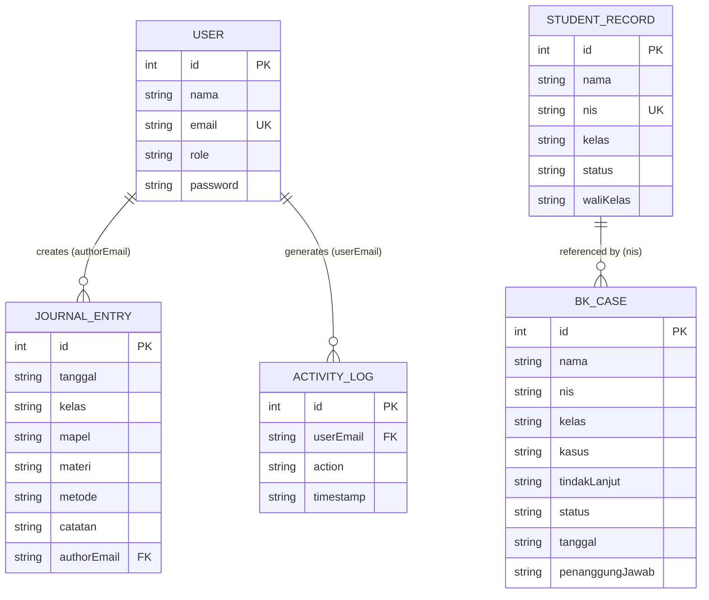

# Software Design Document (SDD)
## SIS-TERPADU — Sistem Informasi Sekolah Terpadu

**Versi:** 1.0  
**Tanggal:** 2026-07-30  
**Kelompok:** Advanced Software Testing & Quality Assurance (ASTQA)  

---

## 1. Gambaran Umum Arsitektur

SIS-TERPADU menggunakan arsitektur **Client-Side SPA (Single Page Application)** dengan React sebagai view layer dan IndexedDB sebagai persistence layer. Sistem ini dirancang agar dapat di-upgrade ke arsitektur full-stack dengan minimal perubahan pada lapisan UI.

### 1.1 High-Level Architecture Diagram



### 1.2 Arsitektur Saat Ini (Current)

```
Browser
├── React SPA (TanStack Router v1)
│   ├── src/routes/index.tsx     ← All UI components (2000+ lines)
│   └── src/routes/__root.tsx    ← Root layout + QueryClient
├── src/lib/mockBackend.ts       ← Business logic + DB access layer
└── IndexedDB (browser storage)
    ├── users
    ├── journalEntries
    ├── bkCases
    ├── students
    └── activityLogs
```

### 1.3 Technology Stack

| Layer | Teknologi | Versi |
|-------|-----------|-------|
| UI Framework | React | 19.2.0 |
| Router | TanStack Router (React Start) | 1.170.x |
| Build Tool | Vite | 8.1.5 |
| Language | TypeScript | 5.x |
| Styling | Inline CSS + Tailwind CSS | 4.2.x |
| Database | IndexedDB (browser-native) | - |
| Session | localStorage | - |
| Testing | Vitest + Cypress | - |

---

## 2. Diagram Komponen



---

## 3. Entity Relationship Diagram (ERD)



---

## 4. API Contract

Saat ini sistem menggunakan fungsi TypeScript langsung (tidak HTTP). Berikut adalah contract API yang siap diimplementasikan sebagai REST API untuk migrasi ke backend:

### 4.1 Auth API

```
POST /api/auth/login
Request:  { email: string, password: string }
Response: { ok: boolean, user?: User, message?: string }

POST /api/auth/logout
Request:  {} (uses session token)
Response: { ok: boolean }
```

### 4.2 Journal API

```
GET    /api/journals?authorEmail=&page=&limit=
Response: { data: JournalEntry[], total: number, page: number }

POST   /api/journals
Request:  { tanggal, kelas, mapel, materi, metode, catatan }
Response: { ok: boolean, entry: JournalEntry }

DELETE /api/journals/:id
Response: { ok: boolean }
```

### 4.3 BK Case API

```
GET    /api/bk-cases?search=&status=
Response: { data: BkCase[], total: number }

POST   /api/bk-cases
Request:  { nama, nis, kelas, kasus, tindakLanjut, status, tanggal, penanggungJawab }
Response: { ok: boolean, bkCase: BkCase }

DELETE /api/bk-cases/:id
Response: { ok: boolean }
```

### 4.4 Student API

```
GET    /api/students?search=
Response: { data: StudentRecord[], total: number }

POST   /api/students
Request:  { nama, nis, kelas, status, waliKelas }
Response: { ok: boolean, student: StudentRecord }

DELETE /api/students/:id
Response: { ok: boolean }
```

### 4.5 User Management API (Admin Only)

```
GET    /api/users
Response: { data: User[] }

POST   /api/users
Request:  { nama, email, role, password }
Response: { ok: boolean, user: User }

DELETE /api/users/:id
Response: { ok: boolean }
```

---

## 5. Alur Data (Data Flow)

### 5.1 Alur Login

```
User Input → loginForm state
    → login(email, password) [mockBackend]
        → checkLoginLockout(email) [localStorage]
            → IF locked → return error message
        → readStore() [IndexedDB]
            → find user by email
            → verifyPassword(input, stored)
                → IF mismatch → recordFailedAttempt() → return error
        → resetAttempts() [localStorage]
        → appendLog() + writeStore() [IndexedDB]
        → persistSessionUser(user) [localStorage]
        → return { ok: true, user }
    → setSessionUser(user) [React state]
    → Render dashboard
```

### 5.2 Alur Simpan Jurnal

```
User Input → journalForm state
    → validate: tanggal <= today
        → IF future date → show validation error, stop
    → saveJournalEntry(form, authorEmail) [mockBackend]
        → readStore() [IndexedDB]
        → push new entry with auto-increment id
        → writeStore() [IndexedDB]
    → refresh listJournalEntries()
    → show success Toast
    → reset form
```

---

## 6. Keputusan Desain (Design Decisions)

| Keputusan | Alasan |
|-----------|--------|
| IndexedDB over localStorage untuk data | Kapasitas lebih besar, mendukung transaksi |
| Semua UI dalam satu file index.tsx | Kesederhanaan MVP; dapat direfaktor ke komponen terpisah |
| Inline CSS (CSSProperties) over Tailwind | Tidak bergantung konfigurasi Tailwind; lebih mudah dikontrol |
| Plain-text password untuk demo | Menyederhanakan onboarding; catatan: gunakan hashing di produksi |
| Brute-force di localStorage | Cepat dan tidak memerlukan round-trip ke server |

---

*Dokumen ini merupakan bagian dari Tugas UAS mata kuliah Advanced Software Testing & Quality Assurance.*
